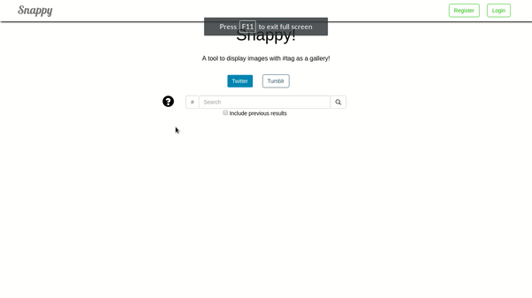

<body style="text-align: center;">
	<h1>Snappy</h1>
	 
	<h3>Overview</h3>
	
Snappy is a tool to display images from Twitter and Tumblr as a Gallery with the given tag.

	 
	<h3>Screencasts</h3>
	 
	<h4>Login and Registration Page</h4>
	 
	
	 
	<h4>Twitter and Tumblr Image Gallery</h4>
	 
	
	 
	<h3>Running the web app</h4>
	 
	<h4>Linux</h4>
	 
	<ol style="text-align: left;">
		<li>Clone the repository - <code>git clone https://github.com/chamow97/snappy</code></li>
		<li>Install python 3 - <code>sudo apt-get update</code> <code>sudo apt-get install python3</code></li>
		<li>Install Django - <code>pip3 install django</code></li>
		<li>Install Tweepy - <code>sudo pip3 install tweepy</code></li>
		<li>Run the web app by navigating into the master directory- <code>python3 manage.py runserver</code></li>
	</ol>
	 
	<h3>Future Works</h3>
	 
	<ul style="text-align: left;">
		<li>Add more websites</li>
		<li>Multiple hashtag search</li>
		<li>Save the search result for prompting the user</li>
	</ul>
	 
	<h3>Contact</h3>
	 
	
For queries or comments, contact here: <a href="mailto:chamow97@hotmail.com">chamow97@hotmail.com</a>

</body>